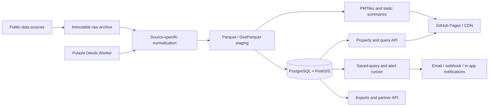

# Pulaski Property Intelligence Platform
## Buildout and Implementation Guide

> **Recommended repository path:** `docs/IMPLEMENTATION_ROADMAP.md`  
> **Last updated:** July 10, 2026  
> **Current project:** [Pulaski County Building Map](https://brandongrant.github.io/pulaski_building_map/)  
> **Repository:** [brandongrant/pulaski_building_map](https://github.com/brandongrant/pulaski_building_map)  
> **Purpose:** Convert the existing public building map into a parcel-centric, source-linked property intelligence platform that can query, compare, monitor, and explain connections across public records.

---

## 1. Executive directive

Do **not** begin by attempting to ingest every public dataset, implementing a graph database, adding an AI chat interface, or rewriting the frontend.

Build the following value chain in order:

1. **Make the existing application reliable and reproducible.**
2. **Carry a stable parcel/property identifier through every dataset and UI interaction.**
3. **Create one canonical property record with a unified event timeline.**
4. **Add a curated multi-source query builder with map and table results.**
5. **Add saved queries, property watchlists, and change alerts.**
6. **Add the public datasets that unlock the highest-value acquisition and redevelopment queries.**
7. **Resolve owners and organizations into an evidence-backed relationship graph.**
8. **Add exports, authenticated workspaces, and an API for paid users.**
9. **Expand to another county only after the Pulaski County workflows have repeat users.**

The initial commercial product should be framed as:

> **Acquisition and Redevelopment Radar:** Find properties that match physical, financial, ownership, zoning, and recent-event criteria; explain why each property matched; save the search; and receive alerts when conditions change.

This is more defensible and easier to sell than a generic promise to make “all public data” searchable.

---

## 2. Current-state audit

### 2.1 What already works

The current repository has a credible technical foundation:

- A fully static MapLibre application hosted on GitHub Pages.
- PMTiles delivery for approximately 225,000 building footprints.
- Assessor-derived year built, type, stories, area, value, vehicle count, and personal-property value.
- Owner and address search.
- Permit, public dispatch, and recent recorded-document overlays.
- Restartable Python scripts for data collection, normalization, spatial matching, and tile production.
- A `data` branch used as an append-only store for frequently refreshed dispatch and deed data.
- A Cloudflare Worker implementation for parcel deed-history lookup.
- Privacy rules for dispatch data and deliberate exclusion of some sensitive recorded-document categories.

Relevant repository references:

- [`README.md`](https://github.com/brandongrant/pulaski_building_map/blob/main/README.md)
- [`docs/SESSION_HANDOFF.md`](https://github.com/brandongrant/pulaski_building_map/blob/main/docs/SESSION_HANDOFF.md)
- [`docs/recorded_documents_plan.md`](https://github.com/brandongrant/pulaski_building_map/blob/main/docs/recorded_documents_plan.md)
- [`pipeline/run_all.py`](https://github.com/brandongrant/pulaski_building_map/blob/main/pipeline/run_all.py)
- [`web/app.js`](https://github.com/brandongrant/pulaski_building_map/blob/main/web/app.js)
- [`worker/README.md`](https://github.com/brandongrant/pulaski_building_map/blob/main/worker/README.md)

### 2.2 Immediate technical constraints

The next build should address these constraints before adding many more layers.

| Constraint | Current condition | Required correction |
|---|---|---|
| Deed-history Worker is dormant | `DEEDS_API` is empty in `web/app.js` | Deploy the Worker, move the service URL into runtime configuration, and add a health check |
| Parcel identity is not carried end-to-end | `join_buildings.py` drops the parcel ID from `buildings_final.pkl`; popup owner matching depends heavily on normalized address | Add stable `property_id`, `parcel_id`, and `building_id` to processed outputs and API calls |
| One pipeline script contains a machine-specific path | `build_owner_index.py` references `D:\Claude Code Projects\Building_Map` | Centralize all paths in configuration and support an environment-variable override |
| Source dates and URLs are embedded in code | `make_tiles.py` hard-codes the CAMA date; `run_all.py` embeds rotating download URLs | Create a source manifest and derive freshness metadata from actual downloads |
| Intermediate data is mostly pickle-based | Pickles are Python-specific and fragile for cross-tool use | Write Parquet/GeoParquet as the canonical staging format |
| Data lineage is implicit | Output files do not consistently identify source version, retrieval time, hash, or transformation version | Generate a build manifest and attach provenance to every database record |
| Browser indexes will not scale to multiple counties | Large owner and vehicle JSON files are loaded client-side | Move searchable indexes to an API after the first database-backed release |
| There is no query backend | Filters are MapLibre expressions and source-specific JavaScript | Add a curated semantic field catalog and safe server-side query compiler |
| There is no test suite or release gate | Scripts are validated manually | Add unit, integration, data-quality, and browser smoke tests |
| The `data` branch is functioning as a warehouse | Frequent scheduled commits and growing JSONL archives | Keep it temporarily, then move immutable raw data and current state into object storage and PostgreSQL |

### 2.3 Product constraints

The product should not present inferred relationships or statistical signals as facts.

Every result must distinguish among:

- **Direct source fact**
- **Normalized fact**
- **Matched fact**
- **Derived metric**
- **Inferred relationship**
- **Statistical association**

Every displayed value or edge should expose:

- Source
- Source record identifier
- Effective date
- Observation or ingestion date
- Matching method
- Matching confidence
- Known coverage limitation

---

## 3. Product scope and first commercial workflow

### 3.1 Primary initial users

Prioritize:

1. Commercial real-estate investors and developers
2. Brokers and land assemblers
3. Contractors and property-service businesses
4. Planning, economic-development, and code-enforcement teams
5. Real-estate attorneys, title researchers, lenders, and insurers
6. Investigative journalists and public-interest researchers

The first implementation should optimize for the first two groups because a single useful acquisition or assemblage discovery can justify a paid subscription.

### 3.2 First complete workflow

A user should be able to:

1. Select or draw an area.
2. Filter by parcel and building attributes.
3. Add event conditions such as deed, permit, vacancy, or zoning activity.
4. Add ownership conditions such as portfolio size or tenure.
5. Rank the results.
6. View results on a map and in a sortable table.
7. Open a property profile with a unified timeline.
8. See why the property matched.
9. Save the query.
10. Receive alerts when a new property matches or an existing property changes.
11. Export a source-linked prospect list.

### 3.3 Reference query for the first release

> Find commercial or mixed-use parcels in selected corridors where the primary building was built before 1980, improvement value per square foot is in the lowest local quartile, no major improvement permit has been issued in seven years, ownership has not changed in ten years, and current zoning permits more intensive use.

This single workflow forces the platform to solve the core problems:

- Canonical property identity
- Cross-source joins
- Temporal events
- Spatial filters
- Derived metrics
- Explainable ranking
- Saved queries and alerts
- Source provenance

### 3.4 Explicit non-goals for the first release

Do not initially build:

- A general-purpose SQL console
- A generic “ask anything” AI chatbot
- A national parcel database
- A graph database
- Automated appraisal or underwriting
- Tenant, borrower, employment, or insurance eligibility scoring
- Individual behavioral or demographic inference
- Bulk person or vehicle surveillance
- A complete frontend rewrite

---

## 4. Target architecture

### 4.1 Architectural decision

Retain the existing static map for base geometry and public exploration. Add a queryable data plane beside it.

Use:

- **MapLibre + PMTiles** for fast, inexpensive base-map delivery
- **PostgreSQL + PostGIS** for canonical entities, events, spatial queries, and current state
- **Python ETL** for collection and normalization
- **A small Python API** for property profiles, queries, saved searches, and exports
- **Object storage** for immutable raw downloads, archives, Parquet, and generated PMTiles
- **A scheduled job runner** for source refreshes and alert evaluation
- **The existing Cloudflare Worker** for polite, cached deed-history access until the county provides a better bulk interface

Do not replace PMTiles with database-rendered building geometry. The database should return property identifiers, centroids, summaries, and result geometry only when needed.

### 4.2 Data flow



### 4.3 Serving strategy

| Data | Serving method | Reason |
|---|---|---|
| Building polygons and low-zoom visual attributes | PMTiles | Efficient static delivery and client rendering |
| Property profile | API JSON | Requires current, multi-source, source-linked data |
| Query results below the anonymous/public cap | API JSON or GeoJSON centroids | Fast highlighting and table display |
| Very large result sets | Server-generated MVT or paged IDs | Avoid transferring full geometry |
| Raw source archives | Object storage | Immutable, versioned, inexpensive |
| Public dispatch points | Existing short-lived GeoJSON policy | Preserves current privacy approach |
| Historical dispatch analysis | Aggregated cells or neighborhood statistics | Avoid historical person-level point exposure |
| Saved searches and alerts | Database | User-specific, stateful workflow |
| Owner/entity relationships | API | Confidence, evidence, and access rules are required |

### 4.4 Recommended repository structure

Do not move every current file immediately. Introduce the following structure incrementally:

```text
pulaski_building_map/
├── api/
│   ├── app/
│   │   ├── main.py
│   │   ├── config.py
│   │   ├── db.py
│   │   ├── models/
│   │   ├── routes/
│   │   │   ├── properties.py
│   │   │   ├── queries.py
│   │   │   ├── entities.py
│   │   │   ├── saved_queries.py
│   │   │   └── exports.py
│   │   └── services/
│   │       ├── query_compiler.py
│   │       ├── property_profile.py
│   │       ├── entity_resolution.py
│   │       └── alerts.py
│   └── tests/
├── db/
│   ├── migrations/
│   ├── views/
│   └── seeds/
├── pipeline/
│   ├── common/
│   │   ├── settings.py
│   │   ├── provenance.py
│   │   ├── quality.py
│   │   └── identifiers.py
│   ├── connectors/
│   ├── transforms/
│   ├── loaders/
│   └── existing scripts during migration
├── jurisdictions/
│   └── ar/
│       └── pulaski.yml
├── schemas/
│   ├── query.schema.json
│   ├── source_manifest.schema.json
│   └── property_profile.schema.json
├── tests/
│   ├── fixtures/
│   ├── golden/
│   ├── integration/
│   └── browser/
├── web/
│   ├── app.js
│   ├── js/
│   │   ├── api.js
│   │   ├── map.js
│   │   ├── property-panel.js
│   │   ├── query-builder.js
│   │   ├── search.js
│   │   └── overlays/
│   └── data/
├── worker/
├── docs/
│   ├── IMPLEMENTATION_ROADMAP.md
│   ├── DATA_DICTIONARY.md
│   ├── DATA_SOURCE_POLICY.md
│   ├── PRIVACY_AND_USE_POLICY.md
│   └── RUNBOOK.md
├── compose.yml
├── pyproject.toml
└── .env.example
```

---

# 5. Ordered implementation plan

## Phase 0A — Activate the deed-history quick win

The Worker is already implemented and tested locally. Deploying it is the highest-value immediate action because it completes a user-visible property timeline without requiring a new architecture.

### Tasks

1. From `worker/`, authenticate and deploy:
   ```bash
   npx wrangler login
   npx wrangler deploy
   ```

2. Verify:
   ```bash
   curl "https://<worker-host>/health"
   curl "https://<worker-host>/deeds?sub=ST+CHARLES+ADN&lot=373&blc="
   ```

3. Stop hard-coding the service URL in `web/app.js`.

4. Add service endpoints to `web/data/config.json` or a separate runtime configuration:
   ```json
   {
     "services": {
       "deeds_api": "https://<worker-host>"
     },
     "features": {
       "deed_history": true
     }
   }
   ```

5. Change the frontend to read:
   ```javascript
   const DEEDS_API = cfg.services?.deeds_api || "";
   ```

6. Keep the existing graceful fallback to the county search site.

7. Add an automated smoke test against `/health`, but do not make public-site deployment fail solely because the county record site is temporarily unavailable.

### Acceptance criteria

- A building with valid subdivision/lot/block data loads a deed-history section inside its popup.
- Cold and cached responses are both tested.
- The popup clearly labels current-owner detection as heuristic.
- The Worker does not expose document images.
- Cache and request limits preserve the current polite-access approach.
- The public map continues working if the Worker is unavailable.

---

## Phase 0B — Make the pipeline reproducible

### 5.1 Centralize paths and configuration

Create `pipeline/common/settings.py`:

```python
from pathlib import Path
import os

REPO_ROOT = Path(__file__).resolve().parents[2]
DATA_ROOT = Path(os.environ.get("PULASKI_DATA_ROOT", REPO_ROOT / "data")).resolve()
RAW_DIR = DATA_ROOT / "raw"
STAGING_DIR = DATA_ROOT / "staging"
PROCESSED_DIR = DATA_ROOT / "processed"
WEB_DATA_DIR = REPO_ROOT / "web" / "data"
```

Update every pipeline script to import these paths. Remove the machine-specific path from `build_owner_index.py`.

Add `.env.example`:

```dotenv
PULASKI_DATA_ROOT=./data
DATABASE_URL=postgresql://...
OBJECT_STORE_BUCKET=...
PULASKI_CAMA_URL=
PULASKI_PP_DUMP1_URL=
PULASKI_PP_DUMP2_URL=
DEEDS_API_URL=
```

### 5.2 Create a source manifest

Add `jurisdictions/ar/pulaski.yml`:

```yaml
jurisdiction:
  id: us-ar-pulaski
  name: Pulaski County, Arkansas
  timezone: America/Chicago
  parcel_id_normalizer: alphanumeric_upper

sources:
  pagis_buildings:
    entity_grain: building
    source_type: arcgis_feature_layer
    service_url: https://www.pagis.org/arcgis/rest/services/MAPS/BaseMap/MapServer/21
    primary_key: OBJECTID
    refresh: monthly
    sensitivity: public_property
    redistribution_reviewed: false

  pagis_parcels:
    entity_grain: parcel
    source_type: arcgis_feature_layer
    service_url: https://www.pagis.org/arcgis/rest/services/MAPS/BaseMap/MapServer/68
    primary_key: PARCELID
    refresh: monthly
    sensitivity: public_property
    redistribution_reviewed: false

  assessor_cama:
    entity_grain: parcel_improvement
    source_type: downloadable_archive
    discovery_url: https://pulaskicountyassessor.net/services/raw-data-export/
    download_url_env: PULASKI_CAMA_URL
    refresh: on_publication
    sensitivity: public_property
    redistribution_reviewed: false

  little_rock_permits:
    entity_grain: permit
    source_type: downloadable_csv
    refresh: weekly
    sensitivity: public_property_event
    display_policy:
      exclude_fields:
        - contractor_name
        - applicant_name

  little_rock_dispatch:
    entity_grain: call_for_service
    source_type: live_feed
    refresh: 15_minutes
    sensitivity: sensitive_location_event
    display_policy:
      exact_point_ttl_hours: 24
      aggregate_after_hours: 24
      never_show_exact_categories:
        - medical
        - welfare
        - death
        - sexual_offense
        - domestic
```

This manifest becomes the single source for:

- URLs
- Source owners
- Refresh cadence
- Primary keys
- Data grain
- Sensitivity
- Display policy
- Attribution
- Terms and redistribution review
- Connector configuration

### 5.3 Replace embedded dates with actual source metadata

`make_tiles.py` currently writes a fixed CAMA date. Instead:

1. Capture retrieval time, source file modification time, HTTP ETag, and SHA-256 when downloading.
2. Store metadata in `data/raw/<source>/source.json`.
3. Pass the actual effective date into `config.json`.
4. Display separate freshness dates for assessor, permits, deeds, and dispatch.

Do not show one global “data updated” date for fields that refresh at different cadences.

### 5.4 Move staging data to Parquet/GeoParquet

For one transition release, write both pickle and Parquet:

```python
df.to_pickle(path.with_suffix(".pkl"))
df.to_parquet(path.with_suffix(".parquet"), index=False)
```

For spatial data, use GeoParquet. Once the database and tests read Parquet successfully, remove pickle as a required interchange format.

### 5.5 Generate a build manifest

Every pipeline run should emit `data/processed/build_manifest.json`:

```json
{
  "build_id": "2026-07-10T18:40:22Z-<git-sha>",
  "code_commit": "<git-sha>",
  "started_at": "2026-07-10T18:02:11Z",
  "completed_at": "2026-07-10T18:40:22Z",
  "sources": {
    "pagis_buildings": {
      "retrieved_at": "...",
      "record_count": 225774,
      "sha256": "..."
    },
    "assessor_cama": {
      "effective_date": "...",
      "retrieved_at": "...",
      "sha256": "..."
    }
  },
  "outputs": {
    "buildings_geoparquet": {
      "record_count": 225774,
      "sha256": "..."
    },
    "buildings_pmtiles": {
      "bytes": 0,
      "sha256": "..."
    }
  },
  "quality": {
    "building_to_parcel_match_rate": 0.0,
    "parcel_to_cama_match_rate": 0.0,
    "permit_geocode_rate": 0.0
  }
}
```

### Acceptance criteria

- A clean clone rebuilds on Windows, macOS, and Linux using documented commands.
- No code contains a user-specific absolute path.
- No freshness date is manually embedded in transformation code.
- Every output can be tied to source hashes and a Git commit.
- A failed or partial source download cannot silently replace the prior good build.
- The previous good PMTiles and API data remain deployable after a failed refresh.

---

## Phase 0C — Add tests and data-quality release gates

### Minimum tooling

Add development dependencies for:

- `pytest`
- `pytest-cov`
- `ruff`
- `mypy` or `pyright`
- `httpx`
- `sqlalchemy`
- `psycopg`
- `alembic`
- `fastapi`
- `pydantic-settings`
- Playwright for browser smoke tests

### Unit tests

Create unit tests for:

- Parcel ID normalization
- Address normalization
- Permit category classification
- Dispatch category and sensitivity classification
- Deed document-type normalization
- Subdivision resolution
- Owner name normalization
- Vehicle extraction filters
- Derived metric formulas

### Golden-record tests

Maintain a small fixture set of known properties representing:

- Single-family parcel
- Commercial parcel
- Condominium or stacked parcel
- Multiple buildings on one parcel
- Parcel with no assessor match
- Trust-owned parcel
- Parcel with block and lot
- Rural legal description
- Address with directional prefix/suffix
- Property with permits and deeds

For each golden property, assert:

- Parcel ID
- Address
- Owner
- Year built
- Building count
- Deed lookup keys
- Permit matches
- Expected timeline events

### Data-quality tests

Run these after every build:

- Unique source record keys
- Valid geometry
- Geometry within expected county bounds
- Row count does not change beyond a configured tolerance without approval
- Match rate does not regress beyond a configured tolerance
- Source freshness is not older than the allowed threshold
- Required fields are not suddenly null
- Event dates are plausible
- Amounts and areas are within defensible bounds
- No excluded sensitive deed or dispatch categories are emitted
- No contractor or applicant names are emitted in public permit output

### Browser smoke tests

At minimum:

1. Load the map.
2. Confirm PMTiles renders.
3. Search by address.
4. Search by owner.
5. Open a building popup.
6. Confirm permit timeline renders.
7. Confirm deed-history fallback or Worker response renders.
8. Toggle each overlay.
9. Run one vehicle search if the feature remains public.
10. Test a narrow mobile viewport.

### Release gate

Do not deploy generated data if:

- A required source download is incomplete.
- Building or parcel counts collapse unexpectedly.
- Geometry is invalid above threshold.
- Match rates regress materially.
- Sensitive categories appear in disallowed outputs.
- The property-profile contract changes without an API version change.

---

# 6. Phase 1 — Establish canonical property identity

This is the most important structural change.

## 6.1 Define the anchor entity

Use a **property** to represent a tax parcel within a jurisdiction.

```text
property_id = internal stable UUID
jurisdiction_id = us-ar-pulaski
source_parcel_id = official parcel identifier
```

A property may contain zero, one, or many buildings. A building belongs to one property at a point in time, subject to match confidence.

Do not use:

- Normalized address as the primary key
- Owner name as the primary key
- Building footprint ID as the property key
- Geographic centroid as the identity

## 6.2 Carry parcel identity through the existing pipeline

Modify `join_buildings.py`.

The parcel join currently retains assessor attributes but drops the parcel ID from the final output. Add at least:

```text
parcel_id
cama_pin
parcel_object_id
land_value
total_value
property_address
property_city
parcel_type
building_source_id
building_to_property_match_method
building_to_property_match_confidence
```

Recommended output fields:

```text
building_id
building_source_id
property_id
parcel_id
year_built
effective_year_built
building_category
stories
assessor_sqft
footprint_sqft
improvement_value
land_value
total_value
situs_address
city
is_primary_building
geometry
source_effective_date
```

Add `pid` or another compact stable identifier to high-zoom PMTiles feature properties. The popup should then request the property profile by ID rather than resolving the owner and events from address.

### Migration behavior

For one release:

1. Use parcel ID when present.
2. Fall back to the current address-based behavior if parcel ID or API is unavailable.
3. Log fallback frequency.
4. Remove address fallback only after measured coverage is acceptable.

## 6.3 Canonical database schema

Use PostgreSQL with PostGIS. The following is a starting schema, not a substitute for versioned migrations.

```sql
create extension if not exists postgis;
create extension if not exists pg_trgm;
create extension if not exists pgcrypto;

create table data_source (
    source_id uuid primary key default gen_random_uuid(),
    slug text not null unique,
    name text not null,
    jurisdiction_id text,
    source_url text,
    source_owner text,
    entity_grain text not null,
    refresh_cadence text,
    sensitivity_class text not null,
    display_policy jsonb not null default '{}'::jsonb,
    terms_reviewed_at timestamptz,
    created_at timestamptz not null default now()
);

create table ingest_run (
    ingest_run_id uuid primary key default gen_random_uuid(),
    source_id uuid not null references data_source(source_id),
    code_commit text,
    started_at timestamptz not null,
    completed_at timestamptz,
    status text not null,
    source_effective_at timestamptz,
    source_etag text,
    source_sha256 text,
    record_count bigint,
    quality_report jsonb not null default '{}'::jsonb,
    error_summary text
);

create table source_record (
    source_record_id uuid primary key default gen_random_uuid(),
    source_id uuid not null references data_source(source_id),
    ingest_run_id uuid not null references ingest_run(ingest_run_id),
    source_key text not null,
    source_record_url text,
    observed_at timestamptz not null,
    effective_at timestamptz,
    payload_hash text not null,
    payload jsonb not null,
    is_deleted boolean not null default false,
    unique (source_id, source_key, payload_hash)
);

create table property (
    property_id uuid primary key default gen_random_uuid(),
    jurisdiction_id text not null,
    source_parcel_id text not null,
    parcel_id_normalized text not null,
    situs_address text,
    situs_address_normalized text,
    city text,
    state text,
    postal_code text,
    centroid geometry(Point, 4326),
    geometry geometry(MultiPolygon, 4326),
    first_seen_at timestamptz not null default now(),
    last_seen_at timestamptz not null default now(),
    unique (jurisdiction_id, parcel_id_normalized)
);

create index property_geometry_gix on property using gist (geometry);
create index property_centroid_gix on property using gist (centroid);
create index property_address_trgm on property using gin (situs_address_normalized gin_trgm_ops);

create table property_snapshot (
    property_snapshot_id uuid primary key default gen_random_uuid(),
    property_id uuid not null references property(property_id),
    source_record_id uuid not null references source_record(source_record_id),
    as_of_date date not null,
    owner_name_raw text,
    owner_name_normalized text,
    year_built integer,
    effective_year_built integer,
    stories numeric,
    assessor_sqft bigint,
    land_value numeric,
    improvement_value numeric,
    total_value numeric,
    assessed_value numeric,
    property_type text,
    legal_description text,
    subdivision text,
    lot text,
    block text,
    attributes jsonb not null default '{}'::jsonb,
    ingested_at timestamptz not null default now(),
    unique (property_id, source_record_id)
);

create index property_snapshot_property_date_idx
    on property_snapshot (property_id, as_of_date desc);

create table building (
    building_id uuid primary key default gen_random_uuid(),
    jurisdiction_id text not null,
    source_building_id text not null,
    property_id uuid references property(property_id),
    geometry geometry(MultiPolygon, 4326) not null,
    centroid geometry(Point, 4326),
    footprint_sqft numeric,
    is_primary_building boolean,
    match_method text,
    match_confidence numeric check (match_confidence between 0 and 1),
    source_record_id uuid references source_record(source_record_id),
    first_seen_at timestamptz not null default now(),
    last_seen_at timestamptz not null default now(),
    unique (jurisdiction_id, source_building_id)
);

create index building_geometry_gix on building using gist (geometry);
create index building_property_idx on building (property_id);

create table event (
    event_id uuid primary key default gen_random_uuid(),
    jurisdiction_id text not null,
    event_type text not null,
    event_subtype text,
    event_at timestamptz not null,
    observed_at timestamptz not null,
    title text not null,
    summary text,
    status text,
    amount numeric,
    source_record_id uuid not null references source_record(source_record_id),
    source_event_key text,
    geometry geometry(Geometry, 4326),
    sensitivity_class text not null default 'public_property_event',
    attributes jsonb not null default '{}'::jsonb,
    unique (source_record_id, event_type)
);

create index event_type_date_idx on event (event_type, event_at desc);
create index event_geometry_gix on event using gist (geometry);

create table event_property_match (
    event_id uuid not null references event(event_id) on delete cascade,
    property_id uuid not null references property(property_id) on delete cascade,
    match_method text not null,
    match_confidence numeric not null check (match_confidence between 0 and 1),
    is_primary boolean not null default true,
    evidence jsonb not null default '{}'::jsonb,
    primary key (event_id, property_id)
);

create index event_property_property_idx
    on event_property_match (property_id, event_id);

create table entity (
    entity_id uuid primary key default gen_random_uuid(),
    entity_type text not null check (entity_type in ('person', 'organization', 'trust', 'government', 'unknown')),
    display_name text not null,
    normalized_name text not null,
    canonical_status text not null default 'unreviewed',
    created_at timestamptz not null default now()
);

create index entity_name_trgm on entity using gin (normalized_name gin_trgm_ops);

create table entity_alias (
    entity_alias_id uuid primary key default gen_random_uuid(),
    entity_id uuid not null references entity(entity_id) on delete cascade,
    alias_raw text not null,
    alias_normalized text not null,
    source_record_id uuid references source_record(source_record_id),
    confidence numeric not null check (confidence between 0 and 1)
);

create table property_interest (
    property_interest_id uuid primary key default gen_random_uuid(),
    property_id uuid not null references property(property_id),
    entity_id uuid not null references entity(entity_id),
    role text not null,
    valid_from date,
    valid_to date,
    source_record_id uuid not null references source_record(source_record_id),
    confidence numeric not null check (confidence between 0 and 1),
    is_inferred boolean not null default false
);

create index property_interest_property_idx on property_interest (property_id, valid_to);
create index property_interest_entity_idx on property_interest (entity_id, valid_to);

create table event_party (
    event_id uuid not null references event(event_id) on delete cascade,
    entity_id uuid not null references entity(entity_id),
    role text not null,
    source_record_id uuid not null references source_record(source_record_id),
    confidence numeric not null check (confidence between 0 and 1),
    primary key (event_id, entity_id, role)
);

create table entity_relationship (
    entity_relationship_id uuid primary key default gen_random_uuid(),
    from_entity_id uuid not null references entity(entity_id),
    to_entity_id uuid not null references entity(entity_id),
    relationship_type text not null,
    valid_from date,
    valid_to date,
    confidence numeric not null check (confidence between 0 and 1),
    is_inferred boolean not null default true,
    evidence jsonb not null,
    created_at timestamptz not null default now()
);
```

Add user, saved-query, watchlist, and notification tables only when the query API is stable.

## 6.4 Event taxonomy

Normalize all current and future events into a shared top-level taxonomy.

Recommended event types:

```text
assessment_snapshot
ownership_transfer
mortgage_recorded
mortgage_released
lien_recorded
foreclosure_notice
easement_recorded
plat_recorded
permit_applied
permit_issued
permit_closed
demolition_permit
unsafe_vacant_status
rental_registration
business_license
zoning_case
code_enforcement
tax_status
dispatch_activity
hazard_update
manual_annotation
```

Retain the original source type in `event_subtype` and `attributes`.

## 6.5 Property profile API

Implement:

```http
GET /v1/properties/{property_id}
GET /v1/properties/{property_id}/timeline
GET /v1/properties/{property_id}/sources
GET /v1/properties/{property_id}/neighbors
```

Example response:

```json
{
  "property_id": "uuid",
  "parcel_id": "official parcel identifier",
  "address": {
    "label": "123 MAIN ST",
    "city": "LITTLE ROCK",
    "state": "AR"
  },
  "current": {
    "owner_display": "EXAMPLE HOLDINGS LLC",
    "year_built": 1968,
    "building_type": "commercial",
    "assessor_sqft": 18500,
    "land_value": 220000,
    "improvement_value": 310000,
    "total_value": 530000,
    "zoning": null
  },
  "metrics": {
    "improvement_value_per_sqft": 16.76,
    "improvement_to_land_ratio": 1.41,
    "years_since_major_permit": 8.2,
    "ownership_tenure_years": 14.6
  },
  "buildings": [],
  "timeline": [
    {
      "event_id": "uuid",
      "event_type": "ownership_transfer",
      "event_at": "2021-04-14",
      "title": "Warranty deed",
      "summary": "Prior owner to current owner",
      "source": {
        "name": "Pulaski County recorded-document index",
        "record_id": "2021012345",
        "url": "..."
      },
      "match": {
        "method": "subdivision_lot_block",
        "confidence": 0.97
      }
    }
  ],
  "freshness": {
    "assessor": "2026-06-28",
    "permits": "2026-07-08",
    "deeds": "2026-06-20"
  },
  "warnings": []
}
```

### Property profile UI

Replace the increasingly dense map popup with:

- A compact popup summary
- A **View property profile** action
- A side drawer or route with:
  - Overview
  - Buildings
  - Ownership
  - Timeline
  - Permits
  - Recorded documents
  - Zoning and land use
  - Risks and overlays
  - Sources and caveats

Use a shareable route:

```text
#/property/<property_id>
```

### Acceptance criteria

- A user can click a building and load the correct parcel without address matching when a parcel ID is present.
- All current permit and deed timeline items appear in one chronologically sorted timeline.
- Every timeline row links to its source or source landing page.
- Current and historical facts show effective and observed dates.
- Accessory structures resolve to the same property but retain distinct building IDs.
- Condominiums and stacked parcels are explicitly tested.
- The API returns warnings for ambiguous or low-confidence matches.

---

# 7. Phase 2 — Build the multi-source query engine

## 7.1 Create a semantic field catalog

The platform should not expose arbitrary database columns. Define a curated field catalog.

Each queryable field needs:

```text
field_key
label
description
entity_grain
data_type
unit
allowed_operators
source_slug
freshness
null_meaning
sensitivity_class
public_or_paid
indexed
```

Example fields:

| Field key | Label | Type | Operators |
|---|---|---:|---|
| `property.year_built` | Year built | integer | `eq`, `lt`, `lte`, `gt`, `gte`, `between`, `is_null` |
| `property.building_type` | Building type | enum | `in`, `not_in` |
| `property.improvement_value_per_sqft` | Improvement value per square foot | decimal | range |
| `property.improvement_to_land_ratio` | Improvement-to-land ratio | decimal | range |
| `ownership.tenure_years` | Ownership tenure | decimal | range |
| `ownership.portfolio_size` | Current owner portfolio size | integer | range |
| `events.major_permit.last_date` | Last major permit | date | before, after, absent |
| `events.deed.count_5y` | Deed count, five years | integer | range |
| `events.permit.value_5y` | Declared permit value, five years | currency | range |
| `zoning.code` | Current zoning | enum | `in`, `not_in` |
| `zoning.intensity_delta` | Allowed vs. current-use intensity | decimal | range |
| `risk.flood_zone` | Flood zone | enum | `in`, `not_in` |
| `spatial.distance_to_corridor_m` | Distance to selected corridor | decimal | range |

The frontend should fetch this catalog and generate controls. Adding a data source should not require manually creating every control in `app.js`.

## 7.2 Build serving views

Create materialized or incrementally maintained views:

```text
property_current
property_event_rollup
property_owner_current
owner_portfolio_summary
property_spatial_context
property_feature_current
```

`property_feature_current` should contain commonly queried fields in one row per property.

Suggested derived metrics:

```text
improvement_value_per_sqft
land_value_per_sqft
improvement_to_land_ratio
building_age
years_since_major_permit
major_permit_count_1y
major_permit_count_5y
permit_declared_value_5y
years_since_last_deed
deed_count_5y
ownership_tenure_years
current_owner_portfolio_size
adjacent_same_owner_count
unsafe_vacant_current
rental_registered_current
business_license_count
zoning_intensity_delta
distance_to_transit_m
distance_to_major_road_m
flood_hazard_class
dispatch_grid_count_30d
```

Do not create a single opaque “opportunity score” as the primary result. Allow users to sort by transparent metrics and optionally combine them into a user-defined score.

## 7.3 Safe query DSL

Do not accept raw SQL.

Example request:

```json
{
  "geometry": {
    "type": "Polygon",
    "coordinates": []
  },
  "filters": {
    "and": [
      {
        "field": "property.building_type",
        "op": "in",
        "value": ["commercial", "mixed_use"]
      },
      {
        "field": "property.year_built",
        "op": "lt",
        "value": 1980
      },
      {
        "field": "property.improvement_value_per_sqft",
        "op": "lt_percentile",
        "value": 25,
        "cohort": ["building_type", "census_tract"]
      },
      {
        "field": "events.major_permit.last_date",
        "op": "before",
        "value": "2019-01-01"
      },
      {
        "field": "ownership.tenure_years",
        "op": "gte",
        "value": 10
      }
    ]
  },
  "sort": [
    {
      "field": "property.improvement_value_per_sqft",
      "direction": "asc"
    }
  ],
  "limit": 500
}
```

Support these condition classes:

- Attribute comparison
- Presence or absence
- Event count in a time window
- Event sequence
- Spatial containment
- Distance
- Adjacency
- Owner portfolio condition
- Relationship condition
- Peer percentile
- User-defined transparent score

## 7.4 Event-sequence queries

The query engine must support sequences such as:

- Deed followed by permit within 180 days
- Lien followed by deed within 365 days
- Demolition permit with no new-construction permit within two years
- Permit investment followed by assessment change
- Multiple acquisitions by the same owner in a period

Compile sequence rules to parameterized `EXISTS` subqueries. Do not materialize every possible sequence.

Conceptual SQL:

```sql
select distinct p.property_id
from property p
where exists (
    select 1
    from event_property_match dm
    join event d on d.event_id = dm.event_id
    where dm.property_id = p.property_id
      and d.event_type = 'ownership_transfer'
      and exists (
          select 1
          from event_property_match pm
          join event pe on pe.event_id = pm.event_id
          where pm.property_id = p.property_id
            and pe.event_type = 'permit_issued'
            and pe.event_at >= d.event_at
            and pe.event_at < d.event_at + interval '180 days'
      )
);
```

## 7.5 Spatial queries

Support:

- Within drawn polygon
- Within named district, corridor, zoning area, or neighborhood
- Within distance of a selected feature
- Adjacent property
- Intersecting hazard or overlay
- Same block or grid
- Contiguous parcel group

Required indexes:

- GIST on parcel geometry
- GIST on building geometry
- GIST on event geometry
- B-tree on event type/date
- B-tree on property and entity foreign keys
- Trigram on normalized name and address

## 7.6 Query response

Return:

```json
{
  "query_id": "uuid",
  "total": 142,
  "items": [
    {
      "property_id": "uuid",
      "parcel_id": "...",
      "address": "...",
      "centroid": [-92.2, 34.7],
      "score": null,
      "matched_rules": [
        {
          "field": "property.year_built",
          "value": 1968,
          "rule": "< 1980"
        },
        {
          "field": "events.major_permit.last_date",
          "value": "2016-09-12",
          "rule": "before 2019-01-01"
        }
      ],
      "freshness": {
        "assessor": "2026-06-28",
        "permits": "2026-07-08"
      }
    }
  ],
  "facets": {},
  "warnings": []
}
```

The `matched_rules` section is mandatory. It is the basis of the “Why this matched” UI.

## 7.7 API routes

```http
GET  /v1/query-fields
POST /v1/queries/execute
POST /v1/queries/estimate
GET  /v1/queries/{query_id}
POST /v1/queries/{query_id}/export
```

`estimate` should return approximate result count and warn about expensive conditions before full execution.

Use cursor pagination. Cap anonymous query size and geometry complexity.

## 7.8 Query UI

Add an **Explore / Query** mode with:

- Geographic scope selector
- Add-filter button
- Field groups:
  - Property
  - Building
  - Ownership
  - Recorded documents
  - Permits
  - Zoning
  - Business and occupancy
  - Hazards
  - Spatial relationships
- Human-readable query summary
- Estimated result count
- Run query
- Map and table synchronization
- Sort and rank controls
- Save query
- Export
- “Why matched” on every row

Do not make users write SQL.

### Acceptance criteria

- The ten reference queries in Appendix A run without custom code.
- Map and table contain the same property set.
- Every result explains each matched rule.
- Queries are parameterized and field-whitelisted.
- Common county-wide queries respond interactively.
- Expensive spatial or graph queries are bounded and rate-limited.
- Null handling is explicit; “no record” is not silently treated as zero.

---

# 8. Phase 3 — Saved queries, watchlists, and alerts

Saved queries and alerts are likely to create more recurring value than additional visualization controls.

## 8.1 Separate two concepts

### Property watchlist

The user selects specific properties, owners, or areas and receives event notifications.

Examples:

- New deed
- New mortgage or lien
- Permit issued
- Demolition
- Unsafe/vacant designation
- Zoning case
- Nearby major permit

### Saved cohort query

The user saves conditions and is notified when a property enters, leaves, or materially changes rank within the result set.

Examples:

- New redevelopment candidate
- New parcel acquired by a watched owner
- Property now meets low-value/no-permit criteria
- Newly adjacent parcel changes ownership

## 8.2 Suggested tables

```sql
create table saved_query (
    saved_query_id uuid primary key default gen_random_uuid(),
    user_id uuid not null,
    name text not null,
    query_version integer not null,
    query_json jsonb not null,
    notification_policy jsonb not null default '{}'::jsonb,
    is_active boolean not null default true,
    created_at timestamptz not null default now(),
    updated_at timestamptz not null default now()
);

create table saved_query_match (
    saved_query_id uuid not null references saved_query(saved_query_id),
    property_id uuid not null references property(property_id),
    first_matched_at timestamptz not null,
    last_matched_at timestamptz not null,
    last_result_hash text not null,
    rank numeric,
    primary key (saved_query_id, property_id)
);

create table watchlist_item (
    watchlist_item_id uuid primary key default gen_random_uuid(),
    user_id uuid not null,
    item_type text not null,
    property_id uuid references property(property_id),
    entity_id uuid references entity(entity_id),
    geometry geometry(Geometry, 4326),
    rules jsonb not null default '{}'::jsonb,
    created_at timestamptz not null default now()
);

create table notification_outbox (
    notification_id uuid primary key default gen_random_uuid(),
    user_id uuid not null,
    saved_query_id uuid references saved_query(saved_query_id),
    property_id uuid references property(property_id),
    event_id uuid references event(event_id),
    notification_type text not null,
    payload jsonb not null,
    dedupe_key text not null unique,
    status text not null default 'pending',
    created_at timestamptz not null default now(),
    delivered_at timestamptz
);
```

## 8.3 Alert evaluation

For the first Pulaski County release, reevaluating active saved queries after each relevant source refresh is acceptable.

Later, optimize by:

1. Identifying properties affected by new or changed source records.
2. Reevaluating only saved queries that reference the changed fields.
3. Comparing new result hashes with prior matches.
4. Writing notification records through an outbox.
5. Sending daily digest by default; immediate alerts only when requested.

## 8.4 Alert contents

Every alert should state:

- What changed
- Why the property now matches
- Event date
- Source date
- Source link
- Previous value
- New value
- Match confidence
- Link to property profile
- Link to edit or pause the alert

### Acceptance criteria

- Alerts are idempotent.
- A source replay does not resend the same alert.
- A correction can generate a correction notice.
- Users can pause, delete, and change frequency.
- Every notification is traceable to the source record that triggered it.
- No sensitive dispatch event generates a property-level historical alert.

---

# 9. Phase 4 — Add the highest-value data sources

Do not prioritize data based on novelty. Prioritize it based on:

1. User decision value
2. Joinability to parcels
3. Update reliability
4. Historical depth
5. Source terms and redistribution rights
6. Sensitivity
7. Cost to maintain

## 9.1 Recommended source order

| Order | Dataset | Value unlocked | Integration method | Notes |
|---:|---|---|---|---|
| 1 | Zoning, future land use, conditional-use and zoning cases | Redevelopment feasibility, intensity mismatch, pending entitlement | Spatial overlay plus case-to-property event matching | Highest-value addition for the acquisition workflow |
| 2 | Unsafe/vacant properties | Distress, code activity, intervention candidates | Parcel/address match and status events | Preserve effective dates and status history |
| 3 | Rental registry | Occupancy/use context and portfolio analysis | Parcel/address match | Do not infer tenant identity |
| 4 | Business licenses | Operating-use context, owner/business relationships, prospecting | Address and entity matching | Separate license holder from parcel owner |
| 5 | North Little Rock permits | County-wide permit coverage | Dedicated parser and address geocoder | Current repository notes indicate a more difficult report portal |
| 6 | Property-tax status or delinquency | Distress and due diligence | Parcel ID whenever possible | Confirm terms and stable bulk access before implementation |
| 7 | Flood, environmental, historic, and infrastructure overlays | Risk and site suitability | Spatial overlay | Favor authoritative polygon sources |
| 8 | 311 and code-enforcement cases | Maintenance and service-demand trends | Parcel/address match, with privacy review | Retain status and resolution events |
| 9 | Corporate registrations and registered agents | Ownership-network resolution | Entity matching | Add only after entity identity and evidence models exist |
| 10 | Public contracts, incentives, and campaign finance | Investigative and economic-development relationships | Entity and address matching | Separate sourced facts from inferred control |

## 9.2 Zoning implementation

Zoning should be the first new source.

Store:

```text
zoning_code
zoning_description
overlay_district
future_land_use
effective_date
source_case_number
conditional_use
planned_development
maximum_or_allowed_intensity fields, where defensibly derivable
```

Do not flatten zoning into a single label. Preserve:

- Base zoning
- Overlay
- Case history
- Conditional uses
- Effective dates
- Source geometry
- Jurisdiction

Create derived fields only after a documented crosswalk:

```text
allowed_residential_density_band
allowed_commercial_intensity_band
current_use_intensity_band
zoning_intensity_delta
```

A positive `zoning_intensity_delta` may indicate under-utilization, but it is not proof that redevelopment is physically, financially, or legally feasible.

## 9.3 Unsafe/vacant and rental registry implementation

Model statuses as events, not only current flags.

```text
status_started
status_observed
status_closed
source_case_id
status_type
resolution
```

Queries should support:

- Currently unsafe/vacant
- Ever unsafe/vacant
- Number of episodes
- Time since first or latest designation
- Corrective permit after designation
- Rental registration active/inactive
- Owner portfolio percentage registered as rental

## 9.4 Business-license implementation

Create separate entities for:

- License holder
- Operating business
- Parcel owner
- Situs address

Do not automatically merge the license holder with the parcel owner.

Useful relationships:

```text
BUSINESS_OPERATES_AT_ADDRESS
ENTITY_HOLDS_LICENSE
PROPERTY_HOSTS_BUSINESS
ENTITY_OWNS_PROPERTY
```

Each must retain evidence and effective dates.

## 9.5 Source onboarding checklist

A new source is not complete until all items are satisfied:

- [ ] Source owner and official URL documented
- [ ] Terms, attribution, and redistribution reviewed
- [ ] Data grain identified
- [ ] Stable source record key identified
- [ ] Effective and observation dates identified
- [ ] Raw snapshots archived
- [ ] Incremental strategy documented
- [ ] Normalized schema mapped
- [ ] Match hierarchy implemented
- [ ] Match quality measured
- [ ] Data-quality thresholds defined
- [ ] Sensitive fields classified
- [ ] Public display policy approved
- [ ] Query fields added to the field catalog
- [ ] Property profile presentation added
- [ ] Tests and golden records added
- [ ] Freshness displayed in the UI
- [ ] Failure and rollback behavior documented

---

# 10. Phase 5 — Ownership and entity relationship graph

## 10.1 Do not begin with a separate graph database

At Pulaski County scale, PostgreSQL tables, recursive CTEs, trigram indexes, and PostGIS are sufficient for the first one-to-three-hop relationship queries.

Introduce a specialized graph database only after measured user demand shows that:

- Traversals routinely exceed a few hops
- Relationship queries dominate workload
- PostgreSQL query plans become a material bottleneck
- Graph algorithms are a core paid workflow

## 10.2 Entity-resolution order

Use deterministic resolution before probabilistic resolution.

### Level 1 — Exact official identifiers

- Corporate registration number
- License identifier
- Parcel ID
- Official document party identifier, if supplied
- Tax or vendor identifier, when legally redistributable

### Level 2 — Exact normalized identity plus corroboration

- Exact normalized organization name plus mailing address
- Exact normalized person name plus co-owner or deed counterpart
- Trust name plus recurring grantor/grantee parties
- Exact registered agent and organization name

### Level 3 — Rule-based probable match

- Common abbreviations and entity suffixes
- Name token similarity plus shared mailing address
- Assessor owner string and deed grantee overlap
- Recurrent transaction counterparties
- Same entity across business license and corporate registry

### Level 4 — Probabilistic candidate

Only create a candidate edge. Do not automatically merge.

Store:

```text
candidate_score
features_used
evidence_records
review_status
reviewed_by
reviewed_at
```

## 10.3 Required normalization

Normalize but retain raw text.

Organization normalization:

- Uppercase
- Whitespace and punctuation
- `L.L.C.` vs `LLC`
- `INCORPORATED` vs `INC`
- Trust vocabulary
- Known county recording variations
- Mailing-address normalization

Person normalization:

- Name order
- Middle initials
- Common suffixes
- Co-owner separators
- Trustee or representative role words

Never discard the original source string.

## 10.4 Evidence-backed edges

Example:

```json
{
  "relationship_type": "SHARES_MAILING_ADDRESS",
  "from_entity_id": "uuid",
  "to_entity_id": "uuid",
  "confidence": 0.92,
  "is_inferred": true,
  "evidence": [
    {
      "source_record_id": "uuid",
      "field": "owner_mailing_address",
      "value": "123 EXAMPLE ST"
    }
  ]
}
```

The interface must label this as an inferred relationship, not common control.

## 10.5 Graph endpoints

```http
GET /v1/entities/{entity_id}
GET /v1/entities/{entity_id}/properties
GET /v1/entities/{entity_id}/relationships?depth=1
GET /v1/entities/{entity_id}/events
POST /v1/relationships/path
```

Limit default traversal depth. Require authentication for bulk entity expansion.

## 10.6 Useful first graph queries

- Properties currently owned by an entity
- Properties formerly owned by an entity
- Entities sharing a mailing address
- Deed counterparties
- Lenders or trustees associated with an owner’s properties
- Adjacent parcels owned by related entities
- Organizations sharing registered agents
- Owner portfolio acquisitions during a period

### Acceptance criteria

- Every edge has evidence.
- Inferred edges have confidence and visible labeling.
- Users can inspect the records supporting a relationship.
- False merges can be split without losing source records.
- Common registered agents or commercial mailing services do not alone establish common control.
- Person-level relationship expansion is rate-limited and audited.

---

# 11. Phase 6 — Correlation and hidden-connection discovery

Correlation discovery should follow the query and entity layers. Otherwise, the system will produce statistically impressive but operationally meaningless results.

## 11.1 Build a feature catalog

Each analytical feature must declare:

```text
feature_key
entity_grain
definition
unit
time_window
source
freshness
missingness
allowed_cohorts
sensitivity
known_biases
```

Do not correlate fields at incompatible grains.

Examples:

- Parcel-level values
- Building-level age and size
- Property-level permit counts
- Owner-portfolio maintenance rate
- Neighborhood-level dispatch aggregates
- Census-tract demographic context

A neighborhood aggregate must not be presented as an attribute of an individual property owner or resident.

## 11.2 Recommended methods

Use:

- Peer-group percentiles
- Spearman correlation for monotonic relationships
- Median and quartile comparisons
- Time-lag analysis
- Event studies
- Spatial clustering
- Change-point detection
- Graph community detection
- Transparent anomaly detection

Avoid presenting a large raw Pearson correlation matrix as the product.

## 11.3 Correlation API

Possible later endpoint:

```http
POST /v1/analysis/correlations
```

Example:

```json
{
  "outcome": "events.permit.value_5y",
  "predictors": [
    "property.building_age",
    "property.improvement_to_land_ratio",
    "ownership.tenure_years"
  ],
  "cohort": {
    "building_type": ["commercial"],
    "geography": "selected_polygon"
  },
  "method": "spearman",
  "minimum_sample": 50
}
```

Return:

- Sample size
- Missingness
- Coefficient
- Confidence interval or resampling interval
- Cohort definition
- Source dates
- Multiple-comparison warning
- Plain-language interpretation
- Explicit statement that correlation is not causation

## 11.4 High-value analytical products

### Redevelopment candidate explanation

```text
Flagged because:
- Building age is in the oldest 18% of comparable commercial properties.
- Improvement value per square foot is in the lowest 12%.
- No major permit has been recorded in 8.4 years.
- Current zoning allows a higher-intensity use than the observed property use.
- Ownership has been unchanged for 14.6 years.
```

### Property-event sequence

```text
Observed sequence:
- Warranty deed recorded
- Remodel permit issued 73 days later
- Assessment improvement value increased in the next assessor snapshot
```

### Portfolio comparison

```text
This owner’s commercial portfolio has:
- Higher permit activity than peer portfolios
- Lower code-enforcement incidence
- Shorter average holding period
```

Do not label an owner “good,” “bad,” “distressed,” “suspicious,” or “high risk” solely from these signals.

## 11.5 Statistical safeguards

- Minimum cohort size
- Suppress small cells
- Report missingness
- Control for obvious property-type and geography differences
- Distinguish repeated observations from independent properties
- Account for spatial autocorrelation in formal studies
- Correct for multiple testing when scanning many factors
- Preserve reproducible analysis configuration
- Exclude sensitive person-level or protected-class proxy inference

---

# 12. Phase 7 — Commercial product layer

## 12.1 Authentication and authorization

Add authentication only after the public property profile and query API are stable.

Roles:

```text
anonymous
registered
professional
team_admin
internal_data_admin
```

Capabilities:

| Capability | Anonymous | Registered | Professional |
|---|---:|---:|---:|
| Public map | Yes | Yes | Yes |
| Single property profile | Yes | Yes | Yes |
| Multi-source query | Limited | Limited | Yes |
| Save query | No | Yes | Yes |
| Alerts | No | Limited | Yes |
| CSV export | No | Limited | Yes |
| Owner graph expansion | Limited | Limited | Yes |
| API key | No | No | Yes |
| Bulk person/vehicle export | No | No | No by default |

## 12.2 Export requirements

Every export should include:

- Property ID
- Parcel ID
- Address
- Selected query fields
- Why matched
- Field source
- Source effective date
- Match confidence
- Export generated date
- Product disclaimer
- Link back to property profile

Do not provide a bare spreadsheet that strips provenance.

## 12.3 API keys and rate limiting

- Store only hashed API keys.
- Log endpoint, field set, record count, and user.
- Rate-limit entity and owner expansion more strictly than property attributes.
- Apply row and area limits.
- Require a declared use for higher-volume access.
- Provide a correction and abuse-reporting channel.

## 12.4 Product telemetry

Track:

- Query started
- Query completed
- Filters used
- Result count
- Property profile opened
- Source link opened
- Query saved
- Alert created
- Export created
- User returned after an alert

Do not send raw owner, person, vehicle, or address search strings to third-party analytics. Record field categories or privacy-preserving hashes where necessary.

## 12.5 First pilot package

The first paid pilot should include:

- Multi-source query builder
- Map and table
- Property profile and timeline
- Up to a defined number of saved searches
- Daily alert digest
- Watchlists
- CSV export with provenance
- Direct feedback channel

Do not add billing before at least a small group of real users repeatedly saves queries or exports results. Manual pilot invoicing is sufficient for initial validation.

---

# 13. Phase 8 — Multi-county expansion

Do not expand statewide by copying Pulaski-specific assumptions.

## 13.1 Jurisdiction adapter

Each county configuration should define:

```text
jurisdiction_id
parcel ID normalization
address normalization
building source
parcel source
CAMA source
CAMA table mappings
owner field mappings
legal-description parser
permit sources
recorded-document source
refresh cadence
display restrictions
source terms
```

Example:

```yaml
jurisdiction:
  id: us-ar-pulaski
  parcel:
    source_key: PARCELID
    normalizer: alphanumeric_upper
  buildings:
    source_key: OBJECTID
  cama:
    parcel_key: ParcelNumber
    tables:
      residential: Residential_Buildings
      commercial: Commercial_Sections
  legal_description:
    strategy:
      - parcel_id
      - subdivision_lot_block
      - address
      - manual_review
```

## 13.2 Expansion gate

Add a second county only when:

- The Pulaski query product has repeat users.
- Core fields are documented.
- Source manifests and connectors are reusable.
- One-command rebuild works.
- Data-quality thresholds are automated.
- Property identity no longer depends on county-specific ad hoc code.
- The first county’s source terms and operational costs are understood.
- There is a user or customer need for the next county.

---

# 14. ETL and source connector standard

## 14.1 Four data layers

### Raw

Immutable original source payloads.

```text
raw/<source>/<retrieval_timestamp>/...
```

Never edit raw files.

### Staging

Source-shaped Parquet or GeoParquet with cleaned types and stable column names.

### Core

Canonical properties, buildings, events, entities, and relationships in PostgreSQL.

### Serving

Materialized views, PMTiles, property-profile responses, query features, and exports.

## 14.2 Connector contract

Each connector should implement equivalent behavior:

```python
class SourceConnector:
    source_slug: str

    def discover(self) -> dict:
        """Return current asset URL, effective date, ETag, and source metadata."""

    def extract(self, since=None):
        """Yield raw source records or download immutable source assets."""

    def normalize(self, raw_record):
        """Return one or more staging records without losing source fields."""

    def validate(self, staging_records) -> dict:
        """Return row counts, null rates, duplicate rates, and domain checks."""

    def watermark(self):
        """Return the next incremental cursor or effective date."""
```

## 14.3 Idempotency

A rerun against the same source version must not create duplicate records.

Use:

```text
source_id + source_key + payload_hash
```

For mutable source records, retain a new `source_record` version when payload changes.

## 14.4 Matching hierarchy

Every source-to-property match should use a documented hierarchy.

Recommended:

1. Official parcel ID
2. Official property or account key
3. Structured legal description
4. Subdivision + lot + block
5. Exact normalized situs address
6. Address point plus spatial containment
7. High-confidence fuzzy address
8. Spatial nearest within a conservative threshold
9. Manual review

Store the method and confidence. Never reduce the result to a simple matched/unmatched Boolean.

## 14.5 Corrections

Do not overwrite a source fact to “fix” it.

Store:

- Source record
- Product annotation
- User-submitted correction
- Review status
- Corrected display value, when approved
- Explanation
- Effective period

This preserves auditability.

---

# 15. Frontend implementation guidance

## 15.1 Preserve the current frontend until the backend is useful

The current vanilla JavaScript application is sufficient for the next backend-backed release. Avoid a React or framework rewrite as a prerequisite.

First split `web/app.js` into ES modules without changing behavior:

```text
web/js/config.js
web/js/state.js
web/js/map.js
web/js/api.js
web/js/search.js
web/js/property-panel.js
web/js/query-builder.js
web/js/overlays/dispatch.js
web/js/overlays/permits.js
web/js/overlays/deeds.js
web/js/vehicle-search.js
```

Use `<script type="module">`.

## 15.2 Add feature flags

Runtime configuration:

```json
{
  "api_base": "https://api.example.com",
  "services": {
    "deeds_api": "https://worker.example.com"
  },
  "features": {
    "property_profiles": true,
    "query_builder": true,
    "saved_queries": false,
    "entity_graph": false,
    "vehicle_search": true
  }
}
```

This allows staged deployment and fallback.

## 15.3 Map interaction contract

A building click should provide:

```text
building_id
property_id
parcel_id
```

The frontend should not derive owner or timeline identity from the displayed address when stable IDs are present.

## 15.4 Result-set display

For query results:

- Return centroids and IDs first.
- Load full property details on demand.
- Use clustering for large result sets.
- Synchronize table hover with map highlight.
- Preserve query state in the URL.
- Allow result selection into a named list.
- Show a clear result cap and export behavior.

## 15.5 Source and confidence display

Every property-profile section should include:

```text
Source name
As-of date
Observed date
Match method
Confidence
Coverage note
Official source link
```

Use a consistent visual component rather than source-specific footnotes.

---

# 16. Privacy, safety, and use restrictions

Public availability does not make every aggregation or use equally appropriate.

## 16.1 Data classification

Use at least:

```text
public_aggregate
public_property
public_property_event
public_person
sensitive_location_event
restricted_product
internal_operational
```

Every source and field receives a class and a display/export policy.

## 16.2 Preserve existing dispatch safeguards

Continue:

- Exact points only for the short public window
- Aggregation after the point window
- No exact medical, welfare, death, domestic, sexual-offense, or similarly sensitive call types
- “Calls for service” language
- No implication that a dispatch is a confirmed crime, report, arrest, or condition of the occupants

For long-term analytics, use grid, block, tract, or neighborhood aggregates with minimum counts.

## 16.3 Vehicle data policy

Vehicle and personal-property data is not necessary for the first paid acquisition workflow.

Recommended policy:

- Do not make individual vehicle search a paid lead-generation feature.
- Do not expose bulk make/model/address exports.
- Do not use vehicle attributes to infer race, income, politics, household composition, or other sensitive characteristics.
- Prefer aggregate vehicle count or broad property-level parking-demand measures when a legitimate planning workflow requires it.
- Reevaluate whether the public make/model search should remain enabled before broader marketing.

## 16.4 Owner and person data

- Default to property and organization workflows.
- Rate-limit person-name expansion.
- Suppress bulk person/address export.
- Preserve exact source spelling and dates.
- Label ownership as “per source as of date.”
- Provide correction and dispute channels.
- Do not infer wrongdoing from LLC networks, shared agents, liens, dispatch activity, or tax status.

## 16.5 Regulated uses

Do not market or permit the platform for decisions about:

- Housing eligibility or tenant screening
- Credit eligibility
- Employment
- Insurance eligibility or pricing
- Individual law-enforcement risk scoring

Those uses can create significant legal and compliance obligations. Obtain qualified counsel before allowing any regulated eligibility workflow.

## 16.6 Terms and audit controls

Add:

- `PRIVACY_AND_USE_POLICY.md`
- Acceptable-use terms
- Query and export audit logs
- API rate limits
- Data correction process
- Security incident procedure
- Retention schedule
- Administrative access review

---

# 17. Deployment and operations

## 17.1 Environments

Maintain:

```text
local
staging
production
```

Do not test new parsers or schema migrations directly against production data.

## 17.2 Local development

Target workflow:

```bash
python -m venv .venv
# activate the environment
pip install -e ".[dev]"
docker compose up -d db
alembic upgrade head
python -m pipeline.run_all --config jurisdictions/ar/pulaski.yml
uvicorn api.app.main:app --reload
python serve.py
```

Document Windows PowerShell equivalents.

## 17.3 Production components

```text
GitHub Pages or CDN       Static web and PMTiles
Managed PostgreSQL        Canonical and query data
API runtime               Property, query, export, and user routes
Object storage            Raw archives, Parquet, PMTiles, backups
Scheduler                  Source refresh and alert evaluation
Cloudflare Worker          Deed-history proxy
Email/webhook provider     Alerts
Monitoring                 API, pipeline, source freshness, and data quality
```

## 17.4 Migration from the `data` branch

Use a mirror-first migration:

1. Continue current GitHub Actions collectors.
2. Load the same outputs into PostgreSQL.
3. Compare record counts and property matches for multiple refreshes.
4. Switch the property profile to database data.
5. Switch owner search to the API.
6. Move immutable raw archives to object storage.
7. Keep summarized public GeoJSON where appropriate.
8. Stop committing high-frequency raw records to Git only after verified restore and replay procedures exist.

## 17.5 Backups

- Enable database point-in-time recovery where available.
- Version raw object storage.
- Retain build manifests.
- Test restoration.
- Store schema migrations in Git.
- Keep a documented procedure to rebuild serving tables from raw data.

## 17.6 Monitoring

Monitor:

- API availability and latency
- Query error rate
- Database connections and slow queries
- Source retrieval success
- Source freshness
- Row-count changes
- Match-rate changes
- Alert backlog
- Notification failures
- Worker error and cache rate
- Public map asset availability
- Scheduled workflow inactivity

Do not treat a successful script exit as sufficient. The script may have produced a materially incomplete dataset.

---

# 18. Ordered engineering backlog

The following sequence is ready to convert into GitHub issues.

| ID | Priority | Deliverable | Completion condition |
|---|---:|---|---|
| PLAT-001 | P0 | Deploy deed-history Worker | Live `/health`; building popup loads history; fallback verified |
| PLAT-002 | P0 | Runtime service configuration | No environment-specific API URL hard-coded in `app.js` |
| DATA-001 | P0 | Central path/settings module | Clean cross-platform build; no user-specific paths |
| DATA-002 | P0 | Source manifest | All current sources have owner, URL, grain, cadence, sensitivity, and policy |
| DATA-003 | P0 | Build manifest and hashes | Every published dataset tied to source versions and code commit |
| DATA-004 | P0 | Parquet/GeoParquet staging | Core intermediate outputs readable without Python pickle |
| QA-001 | P0 | Unit and golden-record tests | Core normalizers, classifiers, and known properties covered |
| QA-002 | P0 | Data-quality gate | Bad counts, freshness, geometry, or sensitive output blocks publication |
| ID-001 | P0 | Carry parcel ID through building join | Every matched building has stable property/parcel identity |
| DB-001 | P1 | PostGIS schema and migrations | Sources, runs, records, properties, snapshots, buildings, and events loaded |
| ETL-001 | P1 | Existing-source database loaders | Assessor, permits, deeds, and dispatch summaries populate canonical tables |
| API-001 | P1 | Property-profile API | One endpoint returns current facts, timeline, sources, confidence, and freshness |
| WEB-001 | P1 | Property-profile drawer | Stable URL and source-linked sections |
| SEM-001 | P1 | Query field catalog | Curated fields, types, operators, units, and source metadata available |
| API-002 | P1 | Safe query compiler | Whitelisted, parameterized attribute, event, temporal, and spatial rules |
| WEB-002 | P1 | Query builder and result table | Reference acquisition query runs without SQL |
| ALERT-001 | P1 | Saved query and watchlist schema | Queries and watched properties persist per user |
| ALERT-002 | P1 | Alert evaluator and outbox | New matching property generates one traceable notification |
| SRC-001 | P1 | Zoning and future-land-use connector | Current overlay and query fields available with source dates |
| SRC-002 | P1 | Unsafe/vacant and rental connectors | Historical status events and current flags available |
| SRC-003 | P2 | Business-license connector | Business, license holder, address, and property remain separate entities |
| SRC-004 | P2 | North Little Rock permits | County permit coverage expanded and match rates measured |
| ENT-001 | P2 | Entity and alias normalization | Raw names retained; deterministic matches have evidence |
| ENT-002 | P2 | Ownership and relationship explorer | One-hop relationships and property portfolio queries work |
| EXP-001 | P2 | Source-linked CSV export | Export includes why-matched, freshness, source, and confidence |
| AUTH-001 | P2 | Accounts and authorization | Saved queries and exports controlled by role |
| OPS-001 | P2 | Raw object-store migration | Data branch no longer sole archive; replay tested |
| ANALYTICS-001 | P3 | Curated correlation service | Cohort, sample, missingness, and caveats shown |
| COUNTY-001 | P3 | Second jurisdiction adapter | New county onboarded without Pulaski-specific code duplication |

---

# 19. Release gates

## Foundation release

Required:

- Deed Worker deployed
- Reproducible pipeline
- Source and build manifests
- Stable parcel ID in building output
- Tests and data-quality report
- Current public map behavior preserved

## Property intelligence release

Required:

- PostGIS canonical model
- Property profile API
- Unified timeline
- Source provenance and freshness
- Property-profile drawer
- Current source loaders

## Query release

Required:

- Field catalog
- Safe query compiler
- Map and table
- Why-matched explanation
- Export
- Query performance and limits
- Reference query suite

## Monitoring release

Required:

- Accounts
- Saved queries
- Watchlists
- Alert deduplication
- Daily digest
- Audit trail

## Ownership graph release

Required:

- Entity aliases
- Evidence-backed deterministic links
- Confidence display
- False-merge correction
- Rate limits
- No unsupported common-control claims

---

# 20. What not to build yet

1. **Do not move all map geometry into an API.** PMTiles already solves this well.
2. **Do not use a graph database first.** PostgreSQL is sufficient for initial relationship depth.
3. **Do not add AI before the field catalog and query DSL exist.** Natural-language querying should compile to the same safe query representation later.
4. **Do not add dozens of sources without provenance and quality gates.**
5. **Do not build a black-box opportunity, distress, crime, or owner-risk score.**
6. **Do not expand statewide before the Pulaski workflow has repeat usage.**
7. **Do not rewrite the entire frontend before property and query APIs are working.**
8. **Do not assume public access grants unrestricted bulk redistribution.**
9. **Do not treat absence of a permit, deed, or case as proof that no event occurred.**
10. **Do not expose inferred relationships without evidence and confidence.**

---

# 21. First pilot definition

The product is ready for an initial professional pilot when a user can complete all of the following without developer assistance:

1. Draw or select a geography.
2. Run the reference redevelopment query.
3. Sort and inspect at least 100 results.
4. Open a property profile.
5. Understand why the property matched.
6. Verify source records.
7. Save the query.
8. Create an alert.
9. Export a source-linked list.
10. Return later and identify what changed.

Measure:

- Time to first useful result
- Percentage of users who save a query
- Percentage who open official source links
- Repeat weekly usage
- Alert open rate
- Export rate
- False-match reports
- Most-used fields
- Most-requested missing sources

Do not measure success primarily by map page views.

---

# Appendix A — Reference acceptance queries

The query engine should support these without custom development.

## A1. Under-improved commercial property

```text
Building type is commercial
Year built < 1980
Improvement value per square foot < local 25th percentile
No major permit in seven years
```

## A2. Recent acquisition followed by work

```text
Ownership-transfer event in the last 365 days
Remodel, addition, demolition, or new-construction permit within 180 days after transfer
```

## A3. Long-held redevelopment candidate

```text
Ownership tenure >= 15 years
Older building
Low improvement-to-land ratio
Zoning allows greater intensity than current use
```

## A4. Unsafe/vacant without corrective activity

```text
Current unsafe/vacant status
No closed major repair or demolition permit after designation
```

## A5. Portfolio acquisition pattern

```text
Current owner portfolio size >= 5
At least 3 acquisitions in the last 24 months
Display all portfolio properties and acquisition dates
```

## A6. Potential assemblage

```text
At least 3 contiguous parcels
Same owner or evidence-backed related entities
Combined area above threshold
Within selected corridor
```

## A7. Demolition without replacement

```text
Demolition permit issued
No new-construction permit within two years
```

## A8. Business use and property mismatch

```text
Active business license at address
Business category does not align with current property-use classification
Flag as a record mismatch for review, not a violation
```

## A9. Property event timeline

```text
For one property, return all deeds, mortgages, releases, liens, permits, unsafe/vacant changes, rental registration changes, assessment snapshots, and zoning cases in chronological order
```

## A10. Hazard-aware redevelopment search

```text
Meets redevelopment criteria
Outside selected flood-hazard classes
Within specified distance of major road or transit corridor
```

## A11. Owner relationship search

```text
Find properties connected to an organization through current ownership, former ownership, shared mailing address, deed counterparty, or registered agent
Return relationship type, confidence, and evidence
```

## A12. Neighborhood change

```text
By neighborhood and quarter:
deed turnover
major permit count and value
demolition count
unsafe/vacant count
assessed-value change
Return aggregates only
```

---

# Appendix B — Recommended next commit sequence

Use small, reversible commits.

```text
1. chore: centralize pipeline paths and environment settings
2. data: add Pulaski source manifest and build manifest
3. test: add normalizer, classifier, and golden-property tests
4. fix: derive assessor freshness instead of hard-coding CAMA date
5. data: retain parcel ID and parcel values in building output
6. web: add property ID to high-zoom PMTiles features
7. ops: deploy deed Worker and move URL to runtime config
8. db: add PostGIS source/property/building/event migrations
9. etl: load current assessor, permit, deed, and dispatch outputs
10. api: add property profile and timeline endpoints
11. web: add property profile drawer and stable route
12. semantic: add property feature view and field catalog
13. api: add safe query compiler and reference-query tests
14. web: add query builder, table, why-matched, and export
15. alerts: add saved queries, watchlists, outbox, and digest
16. data: add zoning and future-land-use source
17. data: add unsafe/vacant and rental-registry sources
18. entity: add evidence-backed owner and organization resolution
```

---

# Appendix C — Minimum documentation set

Create and maintain:

- `README.md` — setup and public project overview
- `docs/IMPLEMENTATION_ROADMAP.md` — this document
- `docs/DATA_DICTIONARY.md` — canonical fields and definitions
- `docs/SOURCE_CATALOG.md` — source URLs, owners, cadence, terms, and fields
- `docs/MATCHING_METHODS.md` — property, address, legal, and entity match rules
- `docs/PRIVACY_AND_USE_POLICY.md` — display, export, and prohibited-use rules
- `docs/RUNBOOK.md` — refresh, rollback, restore, and incident procedures
- `docs/QUERY_FIELD_CATALOG.md` — field definitions and operators
- `docs/ENTITY_RESOLUTION.md` — normalization, confidence, review, and unmerge rules
- `docs/CHANGELOG.md` — data and product changes that affect interpretation

---

# Appendix D — Source-specific implementation notes

## Pulaski County assessor and PAgis

- Prefer parcel ID joins over address joins.
- Preserve both official parcel ID and normalized key.
- Treat assessor values as snapshots, not timeless property facts.
- Preserve parcel-level caveats when values are shown on multiple building footprints.
- Retain the building-to-parcel spatial match method and confidence.
- Do not assume the largest building is always the assessor’s primary improvement; label it as the product’s selected primary footprint.

## Little Rock permits

- Preserve source permit number, issue/application dates, status, declared value, square feet, and raw type.
- Continue excluding contractor and applicant names from public output unless a documented policy changes.
- Preserve failed geocodes for review rather than dropping them without a count.
- Match by parcel ID if a future source exposes it; otherwise record exact-address or fallback quality.
- Model status changes when repeated snapshots are available.

## Public dispatch

- Keep raw archive access internal.
- Preserve the current sensitive-category policy.
- Use historical data only in aggregate serving tables.
- Do not use dispatch activity as a proxy for resident behavior, criminality, or insurability.

## Recorded documents

- Continue the polite, low-request strategy and caching.
- Prefer a Clerk bulk index export for deep historical coverage.
- Preserve grantor, grantee, lender, trustee, legal description, document type, instrument number, and dates as distinct fields.
- Keep military discharges and medical-record authorizations excluded.
- Label current-owner detection and chain membership as heuristics.
- Store the exact matching method: parcel, legal, subdivision/lot/block, address, or manual.

## Owners and entities

- The assessor owner string is a source observation, not necessarily the canonical legal entity.
- Split co-owner strings only when the delimiter and source convention are understood.
- Do not silently merge trusts, individuals, and similarly named organizations.
- Preserve source-specific aliases and effective dates.
- Make evidence inspection available before relationship expansion.

---

# Final implementation rule

Every new feature must answer all five questions:

1. **Which user decision does this improve?**
2. **What is the canonical entity and data grain?**
3. **How is the record matched, and with what confidence?**
4. **What source and effective date support the result?**
5. **What privacy, misuse, or interpretation risk does the feature introduce?**

A feature that cannot answer those questions should not ship.
